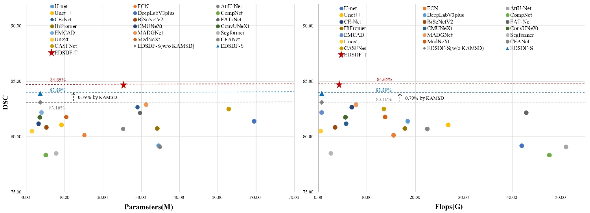
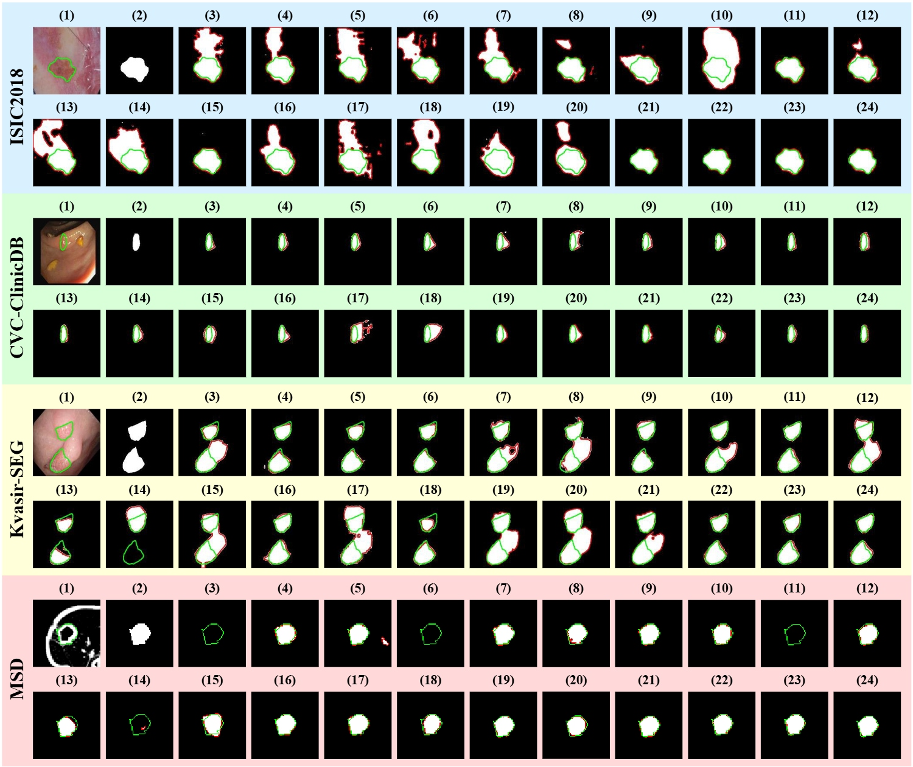
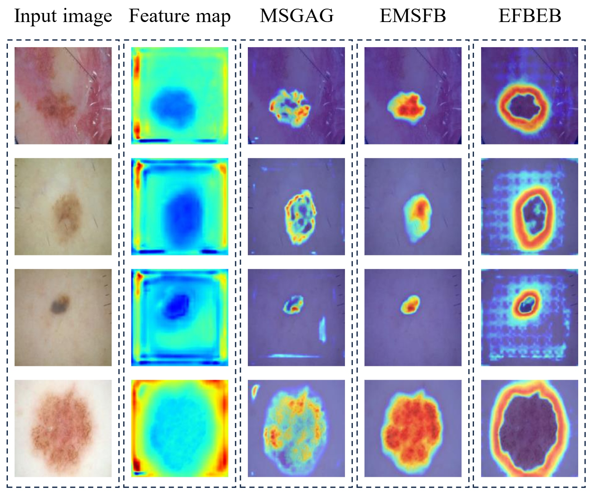

# EDSDF
EDSDF: An Efficient Deep Supervised Distillation Framework for Medical Image Segmentation
### 🚀🚀🚀 May 2025: EDSDF has been accepted by *Neurocomputing*!

## File Descriptions
> 📁 The provided code offers a minimal and illustrative training and evaluation pipeline, intended as a simplified example for quick understanding and reproduction.
- `make_json.py`: Used to generate JSON files containing dataset paths.
- `train_EDSDF.py`: Used to train the EDSDF model.
- `train_EDSDF_KAMSD.py`: Used to train the student model using KAMSD.
- `eval.py`: Used to evaluate model performance.

## Architecture

### EDSDF
<p align="center">

</p>

### Component
<p align="center">

</p>

### KAMSD
<p align="center">

</p>

## Results
<p align="center">

</p>

<p align="center">

</p>
Qualitative comparison of EDSDF with other methods. (1) Input images. (2) Ground Truth. (3) U-net. (4) FCN. (5) AttU-Net. (6) Unet++. (7) DeepLabV3+. (8) CompNet. (9) CE-Net. (10) BiSeNetV2. (11) FAT-Net. (12) HiFormer. (13) CMUNeXt. (14) ConvUNeX. (15) EMCAD. (16) MADGNet. (17) Segformer. (18) Unext. (19) MedNeXt. (20) CFANet. (21) CASFNet. (22) EDSDF-S(w/o KAMSD). (23) EDSDF-S. (24) EDSDF-T. The green and red lines represent the ground truth and predicted boundaries, respectively.

## Feature Map Vis
<p align="center">

</p>

## Dataset

This project supports multiple medical image segmentation datasets, each organized with the following directory structure:

```dataset_root/
├── train/
│ ├── images/
│ ├── masks/
│ └── boundaries/
├── val/
│ ├── images/
│ ├── masks/
│ └── boundaries/
└── test/
├── images/
├── masks/
└── boundaries/```

The datasets used and their corresponding splits are:

- **ISIC2018**: Official split with 2594 training, 100 validation, and 1000 test images.
- **CVC-ClinicDB**: Split with an 8:1:1 ratio for training, validation, and test sets.
- **Kvasir-SEG**: Split with a 3:1:1 ratio.
- **MSD Task06-Lung**: 3D volumes are converted into 2D slices; split with a 3:1:1 ratio.
