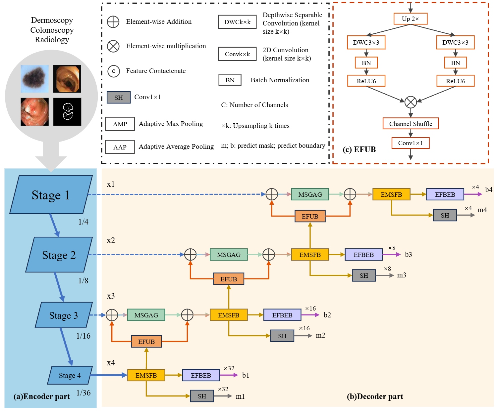

# EDSDF
EDSDF: An Efficient Deep Supervised Distillation Framework for Medical Image Segmentation

## File Descriptions

- `make_json.py`: Used to generate JSON files containing dataset paths.
- `train_EDSDF.py`: Used to train the EDSDF model.
- `train_EDSDF_KD.py`: Used to train the student model using KAMSD.
- `eval.py`: Used to evaluate model performance.

## Architecture

